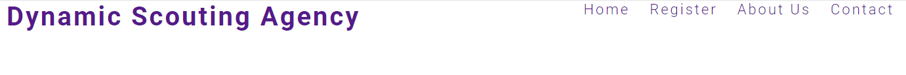
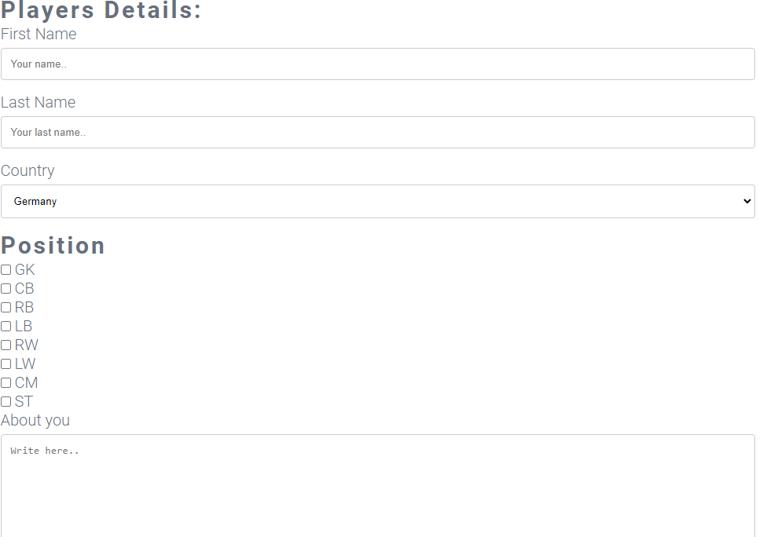
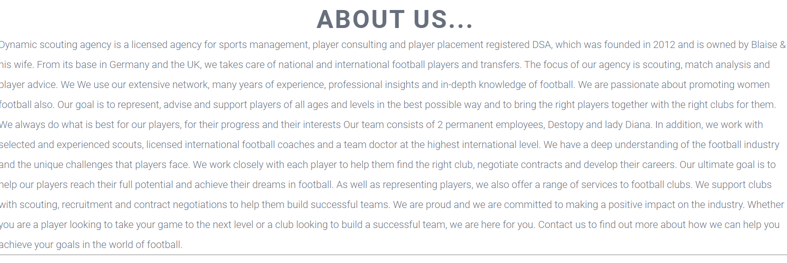
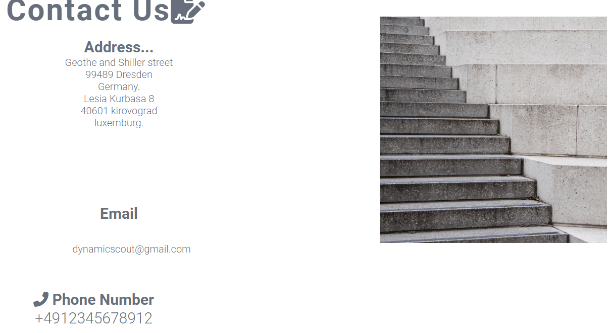

# Dynamic Scouting Agency
Dynamic scouting agency is targeted to talents from different part of the world, helping them achieve them dreams of becoming professional footballers, we hava connections with different different top level clubs within germany and the UK. We are not profit oriented but goal minded.
We have well qualifed staff menber with years of experience who are committed and dedicated to their various fields of responsibilty. 

# FEATURES
### Navigation Bars.
* In this section, i have included 4 links to different pages which includes Home, Register, About us and Contact respectively.

* These various links, will help the user easily navigate to the various pages of interest with ease.

# The main landing page
* The landing page includes a picture, which intends to descibe what the website is basically about. Also, inscribed in the picture is a paragraph, which acts as the company's logo.
* The eye catching football pictures easily lures talented footballers to our platform.

### The Home page.
* This gives or explain a general view of the what the page is all about.
### The register page.
* This page provides a form where interested talented football can register and send in their application and futher information can be passed accross to them.
* Details such as name and last name is required as well as country where they would like to come for trials, positions where they are comfortable in playing. A part to talk yourself is provided.
* With registration, chances of taking part in the trial is a possibility.

### About Us page.
* This page contains specific information about the agency, what it does, its partners and when it was founded.

### Contant us page.
* This comprise of all information on how to reach out to us
* Address, Email and phone number have been provided.
* This enables the talents to be able to reach out to us in case of any issues encountered.

## Footer
* The footer contains links to our various social media handles where you can reach out to us allows for easy navigation for the user.
* The footer is valuable to the user as it encourages them to keep connected via social media.

# Testing
* As at when i tested the page it looked responsive and function well on a screens.
* I can confirm that all navigations links are functional and easy to read.
* The forms on the various pages has to be filled before proceeding.
* I can confirm that the website was tested on chrome and Microsoft Edge.